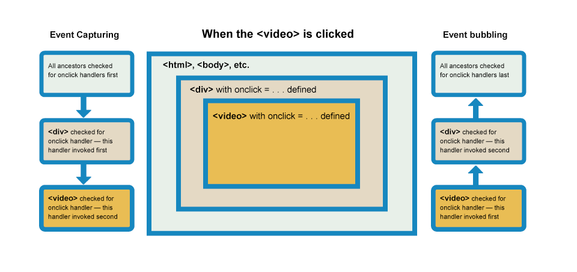

> [事件冒泡及捕获](https://developer.mozilla.org/zh-CN/docs/Learn/JavaScript/Building_blocks/Events#%E4%BA%8B%E4%BB%B6%E5%86%92%E6%B3%A1%E5%8F%8A%E6%8D%95%E8%8E%B7)

当一个事件发生在具有父元素的元素上时，现代浏览器运行两个不同的阶段 - 捕获阶段和冒泡阶段。 

在捕获阶段：
- 浏览器检查元素的最外层祖先`<html>`，是否在捕获阶段中注册了一个`onclick`事件处理程序，如果是，则运行它。
- 然后，它移动到`<html>`中单击元素的下一个祖先元素，并执行相同的操作，然后是单击元素再下一个祖先元素，依此类推，直到到达实际点击的元素。

在冒泡阶段，恰恰相反:
- 浏览器检查实际点击的元素是否在冒泡阶段中注册了一个`onclick`事件处理程序，如果是，则运行它
- 然后它移动到下一个直接的祖先元素，并做同样的事情，然后是下一个，等等，直到它到达`<html>`元素。

### 事件委托

冒泡还允许我们利用事件委托——这个概念依赖于这样一个事实,如果你想要在大量子元素中单击任何一个都可以运行一段代码，您可以将事件监听器设置在其父节点上，并让子节点上发生的事件冒泡到父节点上，而不是每个子节点单独设置事件监听器。

一个很好的例子是一系列列表项，如果你想让每个列表项被点击时弹出一条信息，您可以将`click`单击事件监听器设置在父元素`<ul>`上，这样事件就会从列表项冒泡到其父元素`<ul>`上。
