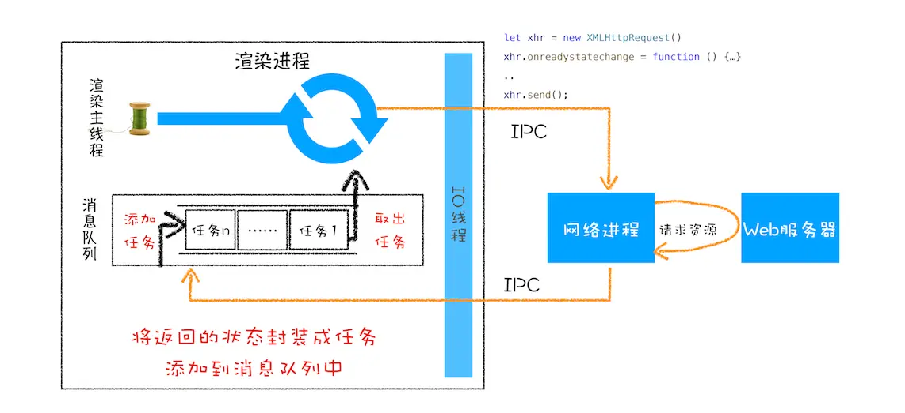
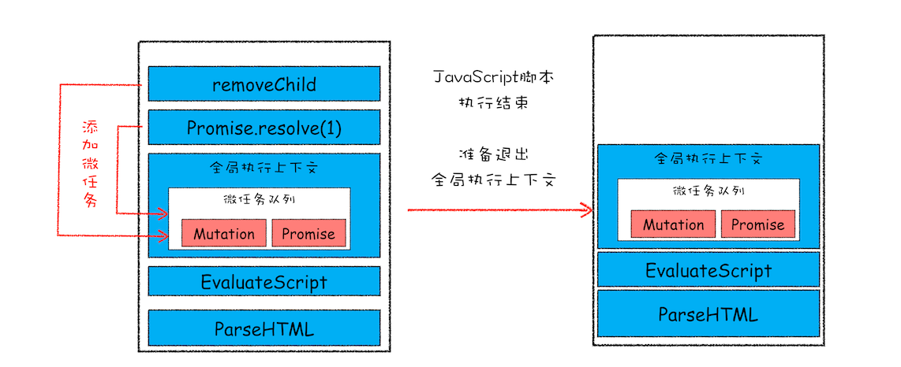
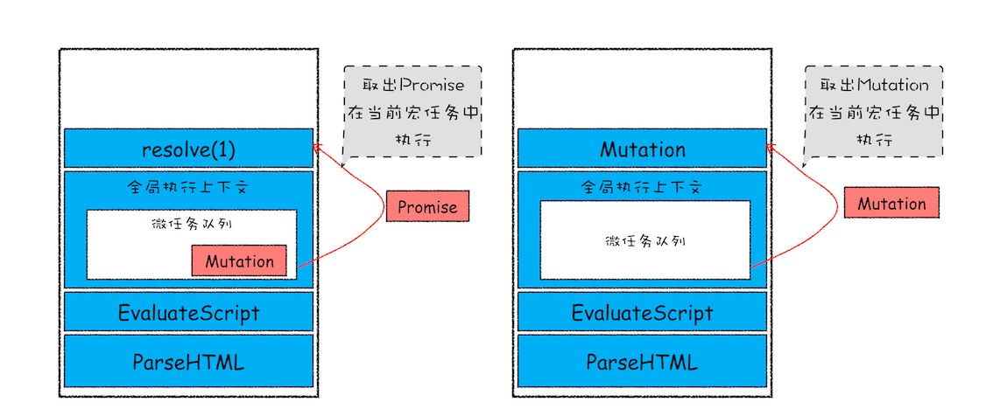
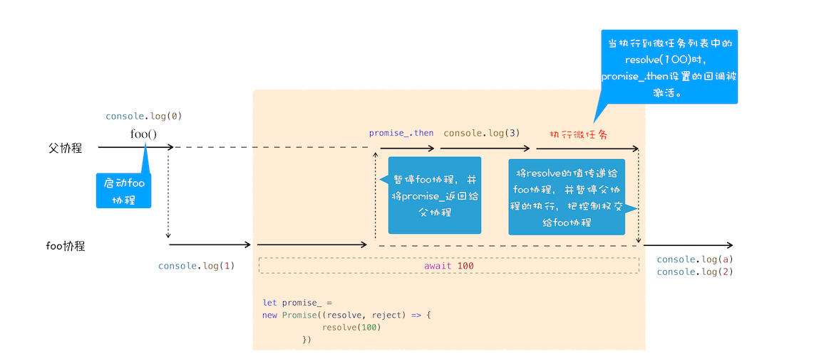

## 事件循环

之所以称为 `事件循环`，是因为它经常按照类似如下的方式来被实现：

```js
while (queue.waitForMessage()) {
  queue.processNextMessage();
}
```

`queue.waitForMessage()` 会同步地等待消息到达（如果当前没有任何消息等待被处理）。


XMLHttpRequest 运行机制



### 添加消息

在浏览器里，每当一个事件发生并且有一个事件监听器绑定在该事件上时，一个消息就会被添加进消息队列。如果没有事件监听器，这个事件将会丢失。所以当一个带有点击事件处理器的元素被点击时，就会像其他事件一样产生一个类似的消息。

函数 `setTimeout` 接受两个参数：待加入队列的消息和一个时间值（可选，默认为 0）。这个时间值代表了消息被实际加入到队列的最小延迟时间。如果队列中没有其它消息并且栈为空，在这段延迟时间过去之后，消息会被马上处理。但是，如果有其它消息，setTimeout 消息必须等待其它消息处理完。因此第二个参数仅仅表示最少延迟时间，而非确切的等待时间。

### 宏任务和微任务

微任务就是一个需要异步执行的函数，执行时机是在主函数执行结束之后、当前宏任务结束之前。

当执行一段脚本的时候，V8 会为其创建一个全局执行上下文，同时在其内部创建一个微任务队列，即**每个宏任务都关联一个微任务队列**。

在主函数执行结束之后，V8 便要销毁这段代码的环境对象，此时环境对象的析构函数被调用（C++ 中的内存释放函数），这里就是 V8 执行微任务的一个检查点，这时候 V8 会检查微任务队列，如果微任务队列中存在微任务，那么 V8 会依次取出微任务，并按照顺行执行。

> 如果一个微任务向队列中加入了更多的微任务，则那些新加入的微任务 会早于下一个宏任务运行。这是因为事件循环会持续调用微任务直至队列中没有留存，即使是在有更多微任务持续被加入的情况下。




宏任务 （macrotask）
- script（整体代码）
- setTimeout
- setInterval
- requestAnimationFrame
- UI 渲染
- setImmediate（Node）
- ......

微任务（microtask）
- Promise.resolve/reject/then/catch
- queueMicrotask
- process.nextTick（Node）

## Async/Await

```js
async function foo() {
    console.log(1)
    let a = await 100
    console.log(a)
    console.log(2)
}
console.log(0)
foo()
console.log(3)
```



## 引用

- [并发模型与事件循环](https://developer.mozilla.org/zh-CN/docs/Web/JavaScript/EventLoop#%E4%BA%8B%E4%BB%B6%E5%BE%AA%E7%8E%AF)
- [深入：微任务与Javascript运行时环境](https://developer.mozilla.org/zh-CN/docs/Web/API/HTML_DOM_API/Microtask_guide/In_depth)
- [通过 queueMicrotask() 使用微任务](https://developer.mozilla.org/zh-CN/docs/Web/API/HTML_DOM_API/Microtask_guide)
