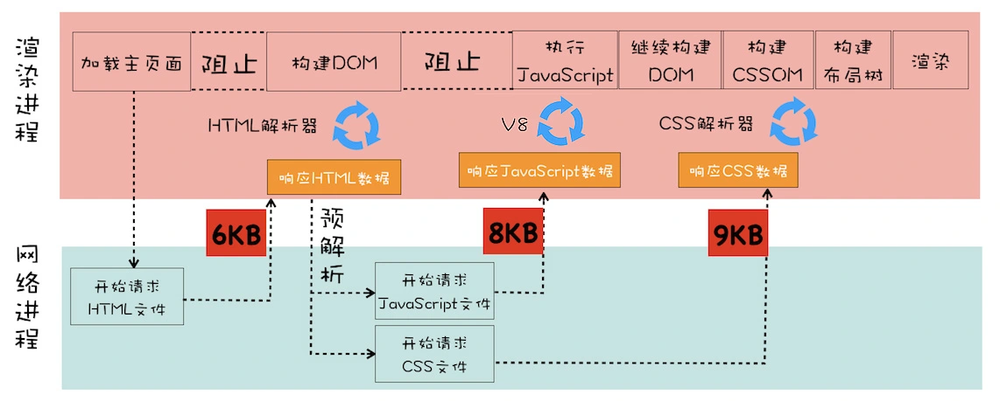

## 加载阶段

明确几个概念：能阻塞网页首次渲染的资源称为关键资源。RTT（Round Trip Time）：一个 TCP 数据包的往返时延。

总的优化原则：
- 减少关键资源个数；
- 降低关键资源大小；
- 降低关键资源的 RTT 个数。

### 减少关键资源个数

1. 将 js 和 css 改成内联的形式；
2. 如果 js 没有 DOM 或者 CSSOM 操作，为 script 标签设置 async 或 defer 属性；
3. 
