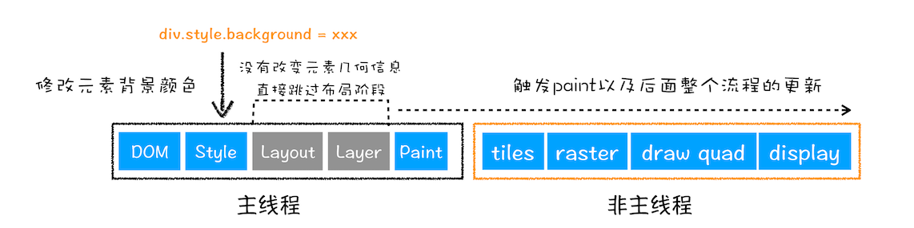

## 1、重排：更新了元素的几何属性

重排需要更新完整的渲染流水线，故开销最大。

## 2、重绘：更新了元素的绘制属性

无需布局和分层，执行效率略高于重排。

## 3、直接合成

直接在合成线程上执行，不占用主线程资源，故效率最高。

## 4、如何减少重排重绘？

1. 用 class 集中定义样式，而不是频繁操作 style；
2. 避免使用 table 布局。小改动会引发整体 table 的布局计算；
3. 批量 DOM 操作，如 [DocumentFragment](https://developer.mozilla.org/zh-CN/docs/Web/API/DocumentFragment)；
4. debounce resize 事件；
5. DOM 属性读写分离。读取/修改操作放在一起执行，不要取一下值，改一下值；
6. 设置 [will-change](https://developer.mozilla.org/zh-CN/docs/Web/CSS/will-change) 为 `opacity`、`transform`、`top`、`left`、`bottom`、`right` 预先创建单独层。[注意事项](https://developer.mozilla.org/zh-CN/docs/Web/CSS/will-change)。
7. `keyframes` 中设置 `transform`、`opacity`、`filter` 等会为元素单独创建一层。`translate3d` 或 `translateZ` 无论是否在动画中，均会单独创建一层。
