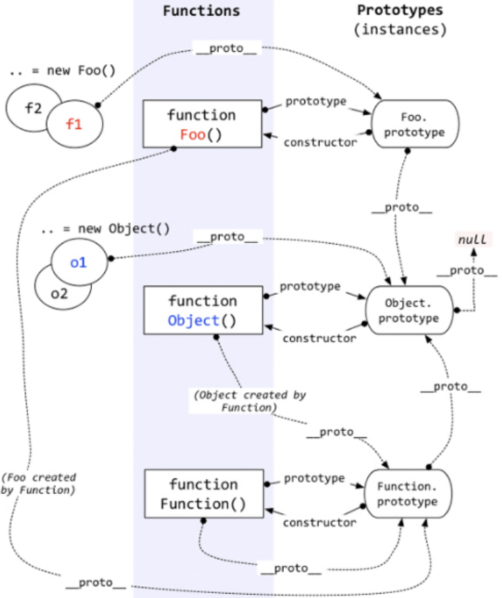

在 js 中我们是使用构造函数来新建一个对象的，每一个构造函数的内部都有一个 `prototype` 属性值，这个属性值是一个对象，这个对象包含了可以由该构造函数的所有实例共享的属性和方法。当我们使用构造函数新建一个对象后，在这个对象的内部将包含一个指针，这个指针指向构造函数的 `prototype` 属性对应的值，在 ES5 中这个指针被称为对象的原型。

一般来说我们是不应该能够获取到这个值的，但是现在浏览器中都实现了 `__proto__` 属性来让我们访问这个属性，但是我们最好不要使用这个属性，因为它不是规范中规定的。我们可以通过 `Object.getPrototypeOf()` 方法来获取对象的原型，或者通过 `Reflect.getPrototypeOf()`。 

当我们访问一个对象的属性时，如果这个对象内部不存在这个属性，那么它就会去它的原型对象里找这个属性，这个原型对象又
会有自己的原型，于是就这样一直找下去，也就是原型链的概念。所有对象的原型最终都可以上溯到 `Object.prototype` ，而 `Object.prototype` 的原型是 `null`，故原型链的尽头是 `null`。

## 特点

JavaScript 对象是通过引用来传递的，我们创建的每个新对象实体中并没有一份属于自己的原型副本。当我们修改原型时，与之相关的对象也会继承这一改变。

## 推荐阅读

- [继承与原型链](https://developer.mozilla.org/zh-CN/docs/Web/JavaScript/Inheritance_and_the_prototype_chain)
