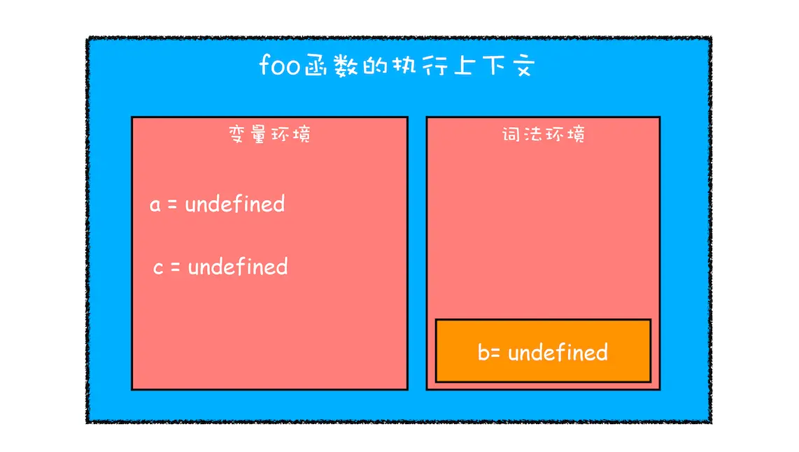
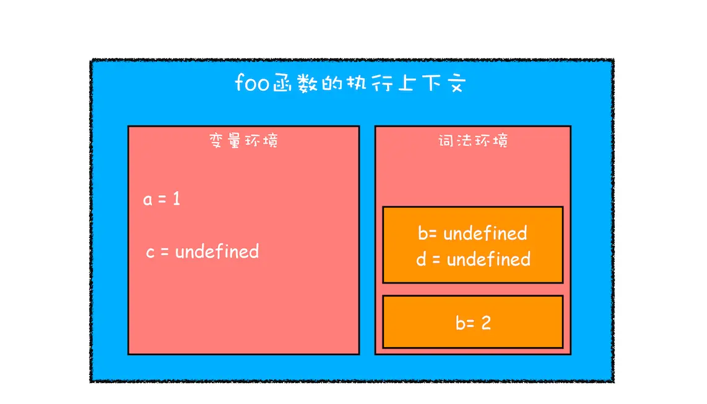
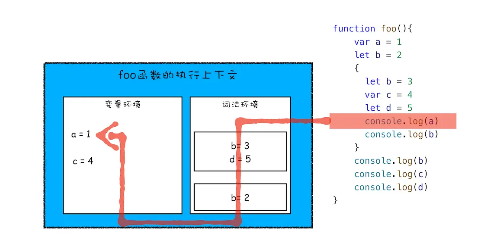
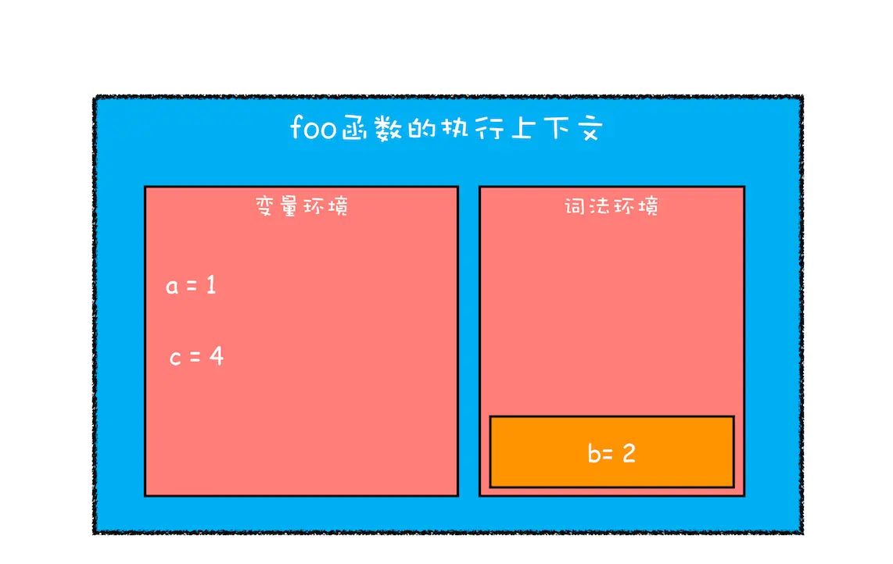

## ES6 如何实现块级作用域的？

```js
function foo() {
    var a = 1
    let b = 2
    {
      let b = 3
      var c = 4
      let d = 5
      console.log(a)
      console.log(b)
    }
    console.log(b) 
    console.log(c)
    console.log(d)
}   
foo()
```

### 1、编译并创建执行上下文



- var 声明变量，编译阶段被存放到**变量环境**。
- let 声明变量，编译阶段被存放到**词法环境**。
- 函数内的作用域块，let 变量并没有被存放到词法环境。

### 2、继续执行



当进入函数的作用域块时，会创建一个单独区域存放 `let b` 和 `let d`，互不影响。

词法环境内部也是维护了一个小型栈结构，栈底是函数最外层的变量。



执行到 `console.log(a)`，单个执行上下文中变量 a 的查找方式：沿着词法环境的栈顶向下查询，如果在某个块中查找到了，就直接返回给 JavaScript 引擎，如果没有查找到，那么继续在变量环境中查找。

### 3、最终的执行上下文



## 思考题

```js
let myname= '极客时间'
{
  console.log(myname) 
  let myname= '极客邦'
}
```

上述代码的执行结果？

```
Uncaught ReferenceError: Cannot access 'myname' before initialization
```
`myname` 只是创建被提升，还未初始化，所以初始化之前调用会形成暂时性死区，故报错。

| # | 创建提升 | 初始化提升 | 赋值提升 |
| - | - | - | - |
| `var` | √ | √ | × |
| `let`/`const` | √ | × | × |
| `function` | √ | √ | √ |
