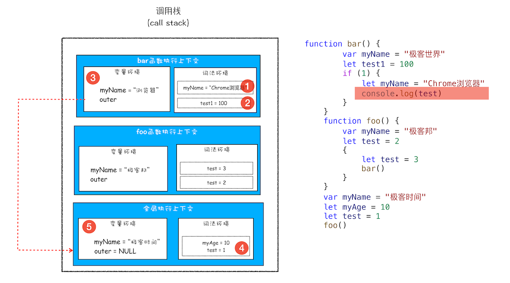

## 作用域链

```js
function bar() {
    console.log(myName)
}
function foo() {
    var myName = "极客邦"
    bar()
}
var myName = "极客时间"
foo()
```


每个执行上下文的变量环境中，都包含一个外部引用，用来指向外部的执行上下文，即图中的 outer。

## 词法作用域

词法作用域就是指作用域是由代码中函数声明的位置来决定的，所以词法作用域是静态的作用域，通过它就能够预测代码在执行过程中如何查找标识符。


**词法作用域是代码编译阶段就决定好的，和函数是怎么调用的没有关系**。


### 块级作用域中的变量查找


