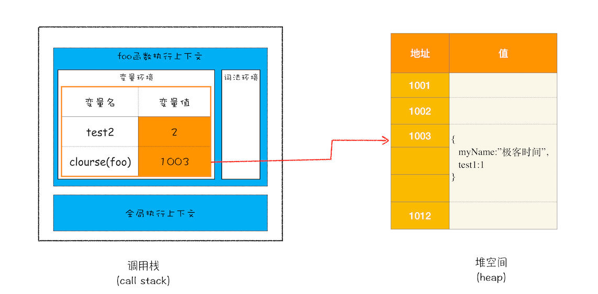

## 闭包

根据词法作用域的规则，内部函数总是可以访问其外部函数中声明的变量，当通过调用一个外部函数返回一个内部函数后，即使该外部函数已经执行结束了，但是内部函数引用外部函数的变量依然保存在内存中，我们就把这些变量的集合称为闭包。比如外部函数是 foo，那么这些变量的集合就称为 foo 函数的闭包。

如果该闭包会一直使用，那么它可以作为全局变量而存在；但如果使用频率不高，而且占用内存又比较大的话，那就尽量让它成为一个局部变量。避免造成内存泄露。

### 闭包内存模型

```js
function foo() {
    var myName = "极客时间"
    let test1 = 1
    const test2 = 2
    var innerBar = { 
        setName(newName) {
            myName = newName
        },
        getName() {
            console.log(test1)
            return myName
        }
    }
    return innerBar
}
var bar = foo()
bar.setName("极客邦")
bar.getName()
console.log(bar.getName())
```

1. 当 JavaScript 引擎执行到 foo 函数时，首先会编译，并创建一个空执行上下文。
2. 在编译过程中，遇到内部函数 setName，JavaScript 引擎还要对内部函数做一次快速的词法扫描，发现该内部函数引用了 foo 函数中的 myName 变量，由于是内部函数引用了外部函数的变量，所以 JavaScript 引擎判断这是一个闭包，于是在堆空间创建换一个“closure(foo)”的对象（这是一个内部对象，JavaScript 是无法访问的），用来保存 myName 变量。
3. 接着继续扫描到 getName 方法时，发现该函数内部还引用变量 test1，于是 JavaScript 引擎又将 test1 添加到“closure(foo)”对象中。这时候堆中的“closure(foo)”对象中就包含了 myName 和 test1 两个变量了。
4. 由于 test2 并没有被内部函数引用，所以 test2 依然保存在调用栈中。



### 总结

产生闭包的核心有两步：
- 第一步是需要预扫描内部函数；
- 第二步是把内部函数引用的外部变量保存到堆中。

---

### 为什么 JS 中的所有函数都是闭包的？

> https://juejin.cn/post/7215207897520767013

JS 中的函数会通过自动隐藏的 `[[Environment]]` 属性记住创建它们的位置，所以它们都可以访问外部变量。

`[[Environment]]`：内见属性
- 每个函数都有；
- 存放词法环境的作用；
- v8引擎中无法读写；

`[[Environment]]` 叫词法环境对象：
- 整个脚本文件执行前会产生一个
- 函数实例创建后会产生一个

`[[Environment]]` 属性记录了：当前函数的词法环境对象==>外层函数的词法环境对象==>全局的词法环境对象；这样就形成了作用域链。

> 有一个例外： 如果我们使用 `new Function` 创建一个函数，那么该函数的 `[[Environment]]` 并不指向当前的词法环境，而是指向全局环境。因此，此类函数无法访问外部（outer）变量，只能访问全局变量。
