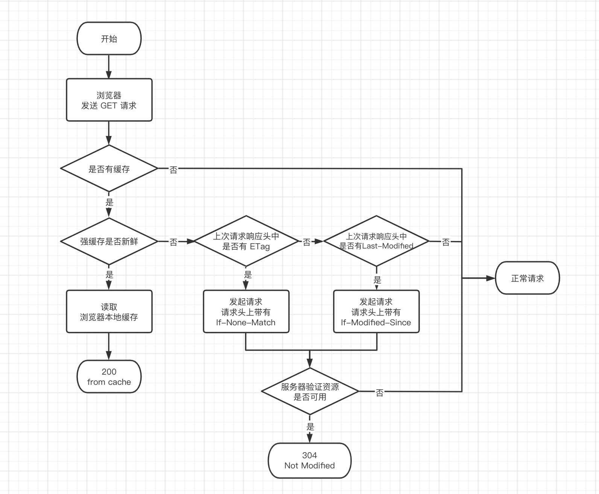

强缓存：由这两个字段其中一个决定

| 属性名 | 示例 | 说明 |
| - | - | - |
| [expires](https://developer.mozilla.org/zh-CN/docs/Web/HTTP/Headers/Expires) | `Expires: Sun, 17 Apr 2022 08:42:54 GMT` | 过期日期 UTC |
| [cache-control](https://developer.mozilla.org/zh-CN/docs/Web/HTTP/Headers/Cache-Control) | `Cache-Control: max-age=30` | 有效时间，单位秒（优先级更高）|

协商缓存：由这两对字段中的一对决定

| 属性名 | 示例 | 说明 |
| - | - | - |
| [Last-Modified](https://developer.mozilla.org/zh-CN/docs/Web/HTTP/Headers/Last-Modified) [If-Modified-Since](https://developer.mozilla.org/zh-CN/docs/Web/HTTP/Headers/If-Modified-Since) | `Last-Modified: Sun, 17 Apr 2022 08:05:01 GMT` | 比对资源最后一次修改时间 |
| [Etag](https://developer.mozilla.org/zh-CN/docs/Web/HTTP/Headers/ETag) [If-None-Match](https://developer.mozilla.org/zh-CN/docs/Web/HTTP/Headers/If-None-Match) | `Cache-Control: max-age=30` | 比对资源内容，可使用内容哈希、最后修改时间戳的哈希等（优先级更高）|

