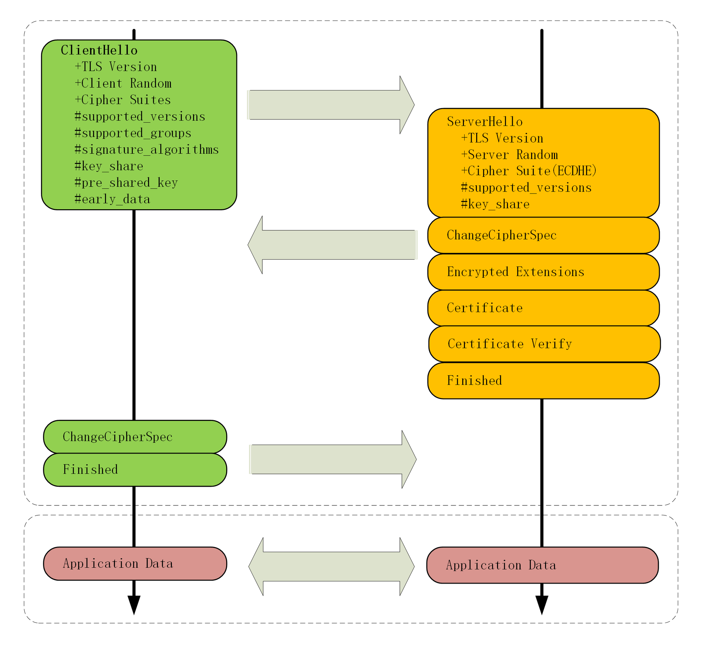
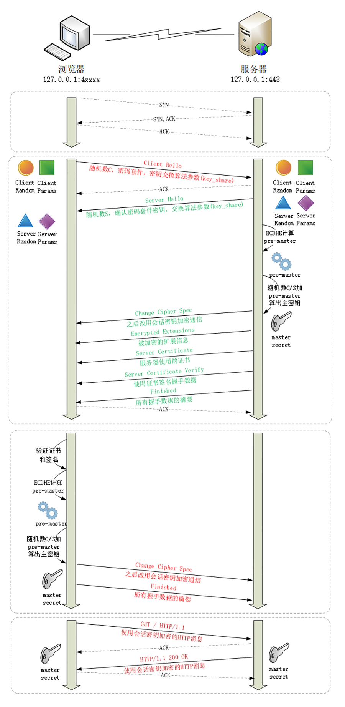

## HTTPS

### TLS 1.3 握手过程

虽然握手过程中的 Hello 报文是明文的，但是因为 [ECDHE 算法](https://www.cnblogs.com/xiaolincoding/p/14318338.html)，即使明文中的算法参数暴露，黑客也算不出真正的密钥。

ECDHE 密钥交换过程：
1. 双方确定使用哪种椭圆曲线，和曲线基点 G，这两个参数是公开的。
2. 客户端生成一个随机数作为`私钥d1`，然后与 G 相乘得到`公钥Q1`。同理，服务端生成`私钥d2`，`公钥Q2`。
3. 双方交换公钥，`d1*Q2=(x1,y1)`，`d2*Q1=(x2,y2)`，根据椭圆曲线的特性，两个点的 x 坐标相同，所以取 x 作为会话密钥。
