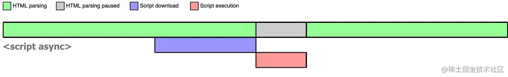
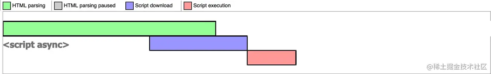
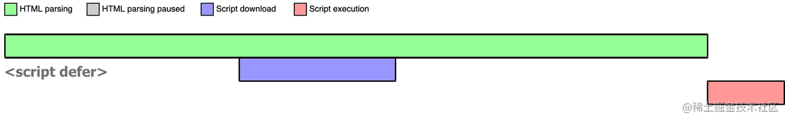

## script

浏览器在解析 HTML 的时候，如果遇到一个没有任何属性的 script 标签，就会暂停解析，先发送网络请求获取该 JS 脚本的代码内容，然后让 JS 引擎执行该代码，当代码执行完毕后恢复解析。

## async script

获取该脚本的网络请求是异步的，不会阻塞浏览器解析 HTML，一旦网络请求回来之后，如果此时 HTML 还没有解析完，浏览器会暂停解析，先让 JS 引擎执行代码，执行完毕后再进行解析。

如果在 JS 脚本请求回来之前，HTML 已经解析完毕了，那就啥事没有，立即执行 JS 代码。

所以 `async` 是不可控的，执行时间不确定，你如果在异步 JS 脚本中获取某个 DOM 元素，有可能获取到也有可能获取不到。而且如果存在多个 `async` 的时候，它们之间的执行顺序也不确定，完全依赖于网络传输结果，谁先到执行谁。

## defer script

获取该脚本的网络请求也是异步的，不会阻塞浏览器解析 HTML，一旦网络请求回来之后，如果此时 HTML 还没有解析完，浏览器不会暂停解析并执行 JS 代码，而是等待 HTML 解析完毕再执行 JS 代码。

注意：`defer` 会阻止 `DOMContentLoaded` 事件，直到脚本被加载并且解析完成。

如果存在多个 `defer` script 标签，浏览器（IE9及以下除外）会保证它们按照在 HTML 中出现的顺序执行，不会破坏 JS 脚本之间的依赖关系。

## 总结

| script 标签        | JS 执行顺序 | 是否阻塞解析 HTML |
| ---------------- | ----------- | ----------- |
| `<script>`       | 在 HTML 中的顺序 | 阻塞          |
| `<script async>` | 网络请求返回顺序  | 可能阻塞，也可能不阻塞 |
| `<script defer>` | 在 HTML 中的顺序 | 不阻塞         |

## 推荐阅读

- [async vs defer attributes](https://www.growingwiththeweb.com/2014/02/async-vs-defer-attributes.html)
- [MDN \<script\>](https://developer.mozilla.org/zh-CN/docs/Web/HTML/Element/script#attr-async)
