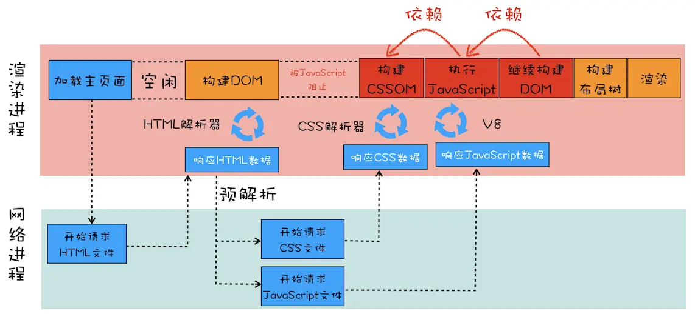
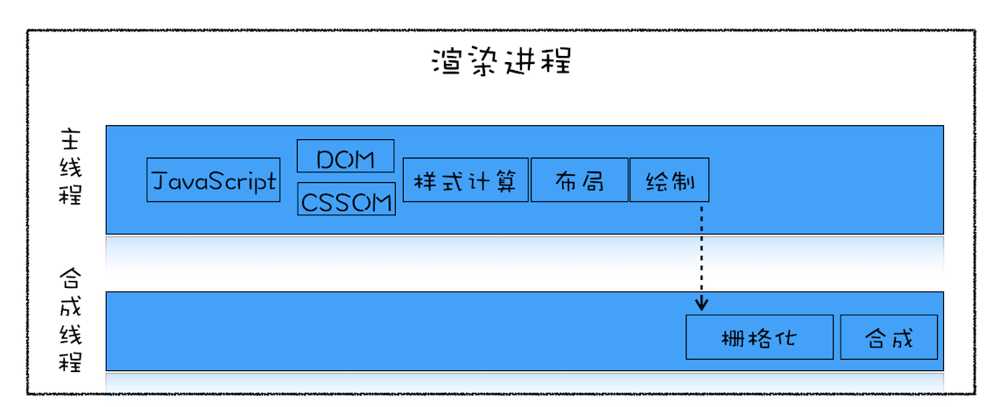

## 一、加载阶段

明确几个概念：能阻塞网页首次渲染的资源称为关键资源。RTT（Round Trip Time）：一个 TCP 数据包的往返时延。

优化原则：
- 减少关键资源个数；
- 降低关键资源大小；
- 降低关键资源的 RTT 次数。

### 减少关键资源个数

1. 将 js 和 css 改成内联的形式；
2. 如果 js 没有 DOM 或者 CSSOM 操作，为 script 标签设置 async 或 defer 属性；
3. 拆分 CSS，通过 link 标签的媒体查询属性，针对不同设备细分加载的 CSS。

### 降低关键资源大小

1. 压缩 js/css，移除代码注释。

### 减少 RTT 次数

除了上述优化手段外，还可利用 CDN 减少每次 RTT 时长

## 二、交互阶段

优化原则：让单个帧的生成速度变快。

### 减少 js 脚本执行时间

1. 分解长任务，保证每次执行时间不要过久。
2. Web Worker。不过 Web Worker 无法操作 DOM 和 CSSOM。

### 避免强制同步布局

正常布局操作：当操作 DOM 之后，需要重新计算样式和布局，正常情况下这是在另外的任务中异步完成的。使用 Performance 工具可观察到 js 执行和样式重计算是两个 task。

强制同步布局：js 强制将计算样式和布局操作提前到当前任务中。比如操作 DOM 后，立即获取了需要重布局之后才是最新值的属性。

### 避免布局抖动

在一个 js 执行中，不断的读取属性值，每次读取属性值之前都要进行计算样式和布局。

尽量不要在修改 DOM 结构时再去查询一些相关值。

### 合理利用 CSS 合成动画

合成动画直接在合成线程上执行，即使主线程被占用，CSS 动画依然能继续执行。尽量把动画交给 CSS 实现，而非 js。

如果提前知道某个元素执行动画操作，可设置 CSS 样式 `will-change`，让渲染引擎为该元素单独生成一个图层。

### 避免频繁的垃圾回收

尽可能优化存储结构，避免小颗粒对象的产生。
