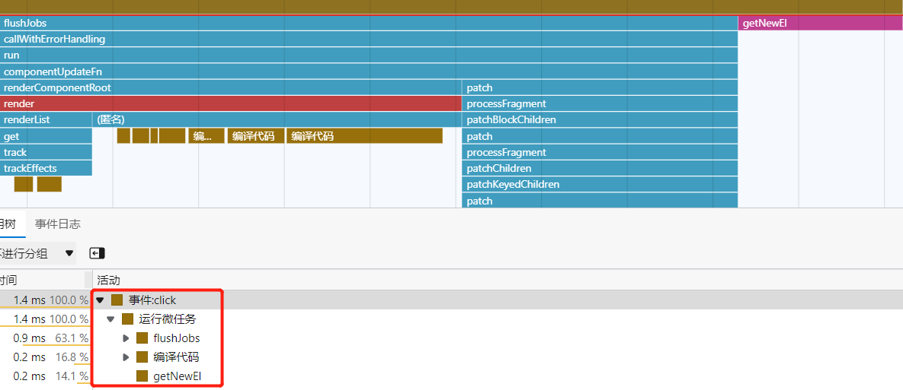

## 内部实现

- 2.x 按照 `Promise` → `MutationObserver` → `setImmediate` → `setTimeout` 的顺序，依次检测，谁可用用谁，包裹 `flushCallbacks` 函数，`nextTick` 传入的回调会被添加到回调队列里，不传入回调且 `promise` 可用会返回一个 `promise`。
- 3.x 直接使用 `promise`。

## 执行原理

**问题：页面渲染在微任务之后执行，为什么我们可以在 nextTick 里拿到最新的 DOM 呢？**

> 渲染是分阶段的：生成 DOM 树 → 计算 DOM 样式 → 生成布局树 → 生成分层树 → 生成绘制表 → 光栅化 → 合成显示

虽然 DOM 还没有被真正渲染到屏幕上，但是 DOM 操作是同步的，DOM 树已经被改变了。在 Vue 中，响应数据变动触发的 DOM 更新操作均是微任务，所以只要是后调用的 `nextTick`，回调微任务就会在 DOM 更新操作之后执行，就可以拿到最新的 DOM 节点了。

## 测试示例

- [微任务中可以获取新 DOM](./index.html)
- [Vue 视图更新的调用栈](./vue.html)

